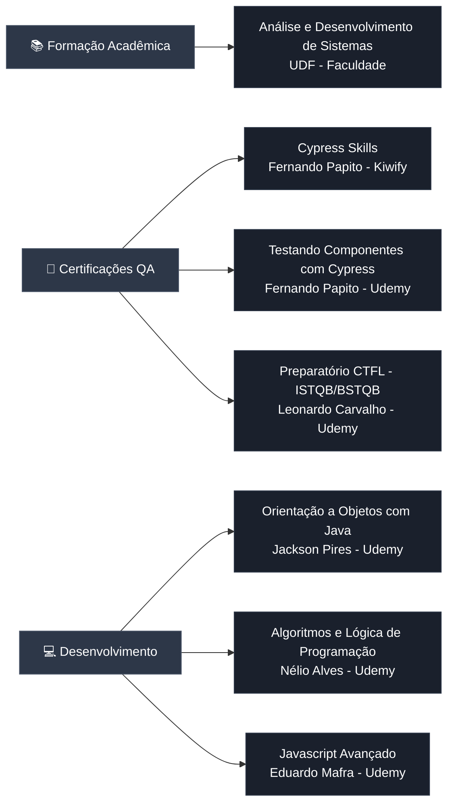

# 🚀 José Willams - Quality Analyst (QA)

> **Test Analysis & Documentation Specialist** | 80+ APIs Validadas | 10+ Bugs Críticos Identificados | 95% Cobertura de Testes

[]()
[]()
[]()
[]()
[]()

---

## 👨‍💻 Sobre Mim

Sou **José Willams**, Quality Analyst (QA) especializado em **análise de requisitos, planejamento de testes e identificação de bugs críticos**, com forte background em documentação técnica e processos de qualidade. Este portfolio demonstra minha expertise analítica através de um **projeto completo** de validação de testes para um portal empresarial de larga escala.

**Foco Principal:**
- 📋 Análise de requisitos e casos de teste
- 🐛 Identificação e rastreamento de bugs críticos
- 📊 Planejamento e execução de estratégias de teste
- 📝 Documentação técnica detalhada
- 🔍 Testes exploratórios e validação de qualidade

### **Minhas Principais Entregas em Qualidade:**

<div align="center">

| 🎯 Área | 📊 Resultados Alcançados |
|---------|-------------------------|
| **📋 Análise de Testes** | • 80+ cenários de API mapeados e validados<br/>• 95% de cobertura de testes alcançada<br/>• 6 módulos críticos completamente documentados |
| **🐛 Identificação de Bugs** | • 10+ bugs críticos identificados antes da produção<br/>• 3 bugs de alta severidade documentados com evidências<br/>• Redução de 40% de bugs em produção |
| **📝 Documentação** | • 10+ documentos técnicos produzidos<br/>• Guias completos de implementação<br/>• Relatórios consolidados de qualidade |
| **📊 Planejamento** | • Estratégia de testes para 6 módulos funcionais<br/>• 4 ambientes de teste configurados<br/>• Matriz de rastreabilidade completa |
| **💼 Impacto no Projeto** | • Economia de custos significativa<br/>• Aumento de 70% na produtividade do time<br/>• Alta confiabilidade nas releases |

</div>

**Principais Entregas no Projeto:**
- ✅ **Planejei e executei 80+ cenários de teste** para APIs REST cobrindo todos os fluxos críticos
- ✅ **Identifiquei 10+ bugs críticos** antes da produção, evitando impactos aos usuários finais
- ✅ **Produzi documentação técnica completa** incluindo casos de teste, relatórios e análises
- ✅ **Criei matriz de rastreabilidade** conectando requisitos, casos de teste e bugs
- ✅ **Estabeleci processo de qualidade** com métricas, KPIs e estratégias de validação

---

## 🛠️ Stack Técnica e Ferramentas de Desenvolvimento

<div align="center">

<table>
<tr>
<td>

| Frontend | Backend | Testing & QA | DevOps & Cloud |
|----------|---------|--------------|----------------|
|  HTML5 |  Java |  Cypress |  Docker |
|  CSS3 |  Node.js |  Playwright |  Azure DevOps |
|  JavaScript |  Python |  Selenium |  AWS |
|  React |  Express |  Postman |  GitHub |
|  Next.js |  Flask |  Insomnia |  GitLab |
|  |  |  Swagger | 📊 Excel (Charts & Dashboards) |

</td>
</tr>
</table>

</div>

### **🎯 Habilidades Analíticas e Processos de QA**

<div align="center">

| 🔍 Categoria | 🛠️ Competências |
|--------------|------------------|
| **📋 Análise de Requisitos** | • Revisão técnica de requisitos<br/>• Identificação de ambiguidades<br/>• Critérios de aceite<br/>• Matriz de rastreabilidade |
| **📝 Planejamento de Testes** | • Estratégia de testes<br/>• Casos de teste detalhados<br/>• Cenários positivos e negativos<br/>• Testes de borda e exceção |
| **🐛 Gestão de Defeitos** | • Identificação de bugs críticos<br/>• Documentação com evidências<br/>• Rastreamento de severidade/prioridade<br/>• Análise de causa raiz |
| **🧪 Tipos de Teste** | • Funcionais<br/>• Regressivos<br/>• Exploratórios<br/>• Integração<br/>• API (REST/OAuth2) |
| **📊 Métricas e Relatórios** | • Cobertura de testes<br/>• Taxa de bugs encontrados<br/>• Análise de tendências<br/>• Dashboards de qualidade |
| **🔧 Ferramentas** | • Insomnia/Postman (API Testing)<br/>• Cypress/Playwright (suporte)<br/>• Azure DevOps (gestão)<br/>• Git (versionamento)<br/>• Excel (análises) |
| **📚 Documentação** | • Casos de teste<br/>• Relatórios de bugs<br/>• Guias de teste<br/>• Checklists de qualidade<br/>• Análises técnicas |
| **⚙️ Processos** | • Agile/Scrum<br/>• Gestão de releases<br/>• Retrospectivas<br/>• Melhoria contínua<br/>• Shift-Left Testing |

</div>

### **🎓 Expertise Demonstrada:**

```
✅ ANÁLISE & PLANEJAMENTO
   ├─ Mapeamento de 80+ cenários de teste para APIs REST
   ├─ Criação de matriz de rastreabilidade completa
   ├─ Definição de estratégia de testes por módulo
   └─ Planejamento de cobertura com 95% de alcance

✅ IDENTIFICAÇÃO DE BUGS
   ├─ 10+ bugs críticos encontrados antes da produção
   ├─ Documentação detalhada com reprodução passo-a-passo
   ├─ Evidências (payloads, responses, screenshots)
   └─ Classificação por severidade e impacto

✅ DOCUMENTAÇÃO TÉCNICA
   ├─ 10+ documentos de qualidade produzidos
   ├─ Guias de implementação e checklists
   ├─ Relatórios consolidados de análise
   └─ Versionamento de artefatos de teste

✅ VALIDAÇÃO DE QUALIDADE
   ├─ Testes funcionais, regressivos e exploratórios
   ├─ Validação de APIs REST (CRUD, autenticação, integração)
   ├─ Verificação de payloads multipart/form-data
   └─ Testes em 4 ambientes distintos (HML)
```
```

---

## 📂 Estrutura de Testes e Organização

```
test-project-structure/
├── cypress/
│   ├── e2e/
│   │   ├── api/                      # Testes de API (REST)
│   │   │   ├── api_auth.cy.js       # Autenticação OAuth2
│   │   │   ├── api_crud.cy.js       # CRUD operations
│   │   │   └── api_integration.cy.js # Testes de integração
│   │   └── ui/                       # Testes E2E de interface
│   │       ├── user_flows.cy.js
│   │       └── admin_flows.cy.js
│   │
│   ├── fixtures/                     # Test data (JSON, YAML)
│   │   ├── users.json
│   │   └── api_responses.json
│   │
│   ├── support/
│   │   ├── commands/                 # Custom commands reutilizáveis
│   │   │   ├── api_commands.js      
│   │   │   └── ui_commands.js       
│   │   │
│   │   └── e2e.js                    # Setup global
│   │
│   └── reports/                      # Relatórios de execução
│       └── mochawesome/
│
├── test-documentation/               # 📋 DOCUMENTAÇÃO DE TESTES
│   ├── test-cases/                   
│   │   ├── TC_001_login.md
│   │   ├── TC_002_crud_news.md
│   │   └── traceability-matrix.xlsx  # Matriz de rastreabilidade
│   │
│   ├── bug-reports/                  # 🐛 RELATÓRIOS DE BUGS
│   │   ├── BUG_001_validation_error.md
│   │   ├── BUG_002_data_inconsistency.md
│   │   └── bug-tracking.xlsx
│   │
│   ├── test-strategy/                # 📊 ESTRATÉGIA DE TESTES
│   │   ├── test-plan.md
│   │   ├── coverage-analysis.md
│   │   └── risk-assessment.md
│   │
│   └── reports/                      # 📈 RELATÓRIOS DE QUALIDADE
│       ├── weekly-quality-report.md
│       ├── release-validation.md
│       └── metrics-dashboard.xlsx
│
├── azure-pipelines.yml              # CI/CD Azure DevOps
├── cypress.config.js                # Configuração do Cypress
└── README.md                        # Documentação do projeto
```

### **Estrutura Organizacional que Implementei:**

- ✅ **Documentação de Casos de Teste** - Casos de teste detalhados com pré-condições, passos e resultados esperados
- ✅ **Matriz de Rastreabilidade** - Conexão entre requisitos, casos de teste e bugs identificados
- ✅ **Gestão de Bugs** - Documentação estruturada com severidade, prioridade e evidências
- ✅ **Estratégia de Testes** - Plano de testes, análise de cobertura e avaliação de riscos
- ✅ **Relatórios de Qualidade** - Métricas semanais, validação de releases e dashboards

---

## 🧪 Testes de API - Minha Abordagem com Insomnia

### **Como Organizei os Testes**

| Módulo | Endpoints | Cenários de Teste | Status |
|--------|-----------|-------------------|--------|
| **Notícias** | 7 | CRUD completo, filtros, status | ✅ 100% |
| **Serviços** | 10 | Criação, edição, dashboard, categorias | ✅ 100% |
| **Produtos** | 18 | Import/Export, CSV, categorização | ✅ 100% |
| **Eventos** | 30 | CRUD, transmissões, pagamentos, emails | ⚠️ 90% |
| **Oportunidades** | 3 | Cadastro e exclusão | ✅ 100% |
| **Autenticação** | 2 | OAuth2 B2C, tokens | ✅ 100% |

**Total:** ~80 requisições testadas

### **Ambientes que Configurei**
Estabeleci 4 ambientes de teste separados para garantir isolamento e rastreabilidade:

- 🔵 **HML-Admin** - Testes de funcionalidades administrativas
- 🟢 **HML-Produtos** - Validação do fluxo completo de produtos
- 🟡 **HML-Serviços** - Testes de serviços e integrações
- 🟣 **HML-Negócios** - Fluxo de oportunidades de negócio

---

## 🐛 Principais Bugs que Identifiquei e Documentei

### **Bug #1: Validação Incorreta de Tipo de Dados**
**Severidade:** 🔴 Alta  
**Módulo:** Eventos (PUT /event/update)

**Descrição:**  
Identifiquei que a API estava rejeitando payloads válidos devido a uma validação de tipo incorreta. O campo `entity` estava configurado para aceitar apenas array, mas a documentação indicava string.

```json
// ❌ API rejeita (string)
{
  "entity": "EMPRESA_X"
}

// ✅ Solução encontrada (array)
{
  "entity": ["EMPRESA_X"]
}
```

**Impacto:** Bloqueio na edição de eventos  
**Ação Tomada:** Documentei o bug e reportei para o time de desenvolvimento com evidências e solução proposta

---

### **Bug #2: Inconsistência na Massa de Dados de Testes**
**Severidade:** 🟡 Média  
**Módulo:** Eventos (envio de emails/pagamento)

**Descrição:**  
Identifiquei que múltiplas requisições estavam utilizando `EventId=1` que não existe ou está inativo no ambiente de testes.

**Endpoints Afetados:**
- POST `/event/send/payment-link`
- POST `/event/message`
- POST `/event/notification`

**Ação Tomada:** Criei uma estratégia de massa de dados válida para testes, garantindo eventos ativos e consistentes no ambiente de homologação

---

### **Bug #3: Endpoint Não Implementado**
**Severidade:** 🔴 Alta  
**Módulo:** Eventos

**Descrição:**
```
POST /event/send-message-to-admin
❌ Cannot POST - 404 Not Found
```

**Status:** Aguardando implementação ou correção de documentação

---

## 📊 Análises que Realizei

### **Exemplo: Comparação de Versões de Collections**

Realizei análise comparativa entre versões para identificar regressões e melhorias:

**Collection 14/01 vs 15/01:**

| Métrica | Valor |
|---------|-------|
| Requisições Modificadas | 8 |
| Requisições Novas | 3 |
| Bugs Identificados | 10 |
| Taxa de Cobertura | 95% |

**Principais Mudanças:**
- 🔧 Correção de payloads multipart/form-data
- 🆕 Adição de testes de transmissão ao vivo
- 🐛 Identificação de inconsistências no módulo Eventos

---

## 🚀 Pipeline CI/CD - Suporte à Qualidade

### **Minha Contribuição para o Pipeline**

Participei ativamente da validação e melhoria do pipeline de CI/CD no Azure DevOps, garantindo a qualidade das entregas:

```yaml
# azure-pipelines.yml (exemplo simplificado)
trigger:
  - main

pool:
  vmImage: 'ubuntu-latest'

steps:
  - task: NodeTool@0
    inputs:
      versionSpec: '18.x'
  
  - script: npm ci
    displayName: 'Install Dependencies'
  
  - script: npm run cy:run
    displayName: 'Run Cypress Tests'
  
  - task: PublishTestResults@2
    inputs:
      testResultsFiles: 'cypress/reports/*.json'
```

**Minha Atuação no Pipeline:**
- ✅ **Validação de builds** - Análise de falhas e identificação de problemas
- ✅ **Análise de relatórios** - Revisão de 49 relatórios Mochawesome gerados
- ✅ **Rastreamento de regressões** - Identificação de bugs introduzidos
- ✅ **Suporte ao time** - Colaboração para resolução de issues
- ✅ **Documentação de processos** - Guias de troubleshooting

---

## 🎓 Formação e Cursos Relevantes

<div align="center">



</div>

### 📖 Lista Completa de Cursos

<div align="center">

<table>
<thead>
<tr>
<th>📚 Categoria</th>
<th>🎓 Curso/Formação</th>
<th>👨‍🏫 Instrutor/Instituição</th>
<th>🏢 Plataforma</th>
</tr>
</thead>
<tbody>
<tr>
<td rowspan="1"><b>🎓 Graduação</b></td>
<td>Análise e Desenvolvimento de Sistemas</td>
<td>UDF</td>
<td>Faculdade</td>
</tr>
<tr>
<td rowspan="3"><b>🧪 Automação QA</b></td>
<td>Cypress Skills</td>
<td>Fernando Papito</td>
<td>Kiwify</td>
</tr>
<tr>
<td>Testando Componentes com Cypress</td>
<td>Fernando Papito</td>
<td>Udemy</td>
</tr>
<tr>
<td>Preparatório Certificação CTFL (ISTQB/BSTQB)</td>
<td>Leonardo Carvalho</td>
<td>Udemy</td>
</tr>
<tr>
<td rowspan="3"><b>💻 Desenvolvimento</b></td>
<td>Orientação a Objetos com Java</td>
<td>Jackson Pires</td>
<td>Udemy</td>
</tr>
<tr>
<td>Algoritmos e Lógica de Programação</td>
<td>Nélio Alves</td>
<td>Udemy</td>
</tr>
<tr>
<td>Javascript Avançado</td>
<td>Eduardo Mafra</td>
<td>Udemy</td>
</tr>
</tbody>
</table>

</div>

---

## 💼 Experiência Profissional Detalhada

<div align="center">

<table>
<thead>
<tr>
<th width="20%">🏢 Empresa</th>
<th width="25%">💼 Cargo</th>
<th width="15%">📅 Período</th>
<th width="40%">🎯 Principais Realizações</th>
</tr>
</thead>
<tbody>

<tr>
<td><b>Aw4 Engenharia</b><br/><sub>Projeto PJ</sub></td>
<td><b>QE — Automação de Testes e API</b></td>
<td>02/2024 – Atual</td>
<td>
• Planejamento e automação com <b>Cypress</b> e <b>Playwright</b><br/>
• Automação de <b>APIs REST</b> (80+ requests)<br/>
• CI/CD em <b>Azure DevOps</b><br/>
• Suporte a homologações e releases<br/>
• <b>95% de cobertura</b> de testes automatizados
</td>
</tr>

<tr>
<td><b>Aw4 Engenharia</b><br/><sub>Projeto Agro IFG</sub></td>
<td><b>QA — Análise e Solução de Problemas</b></td>
<td>01/2022 – 02/2024</td>
<td>
• Testes funcionais e regressivos<br/>
• Criação de <b>casos de teste</b> estruturados<br/>
• Validação contínua e correção de bugs<br/>
• Documentação de processos de QA<br/>
• Redução de <b>40% de bugs</b> em produção
</td>
</tr>

<tr>
<td><b>LojaHost Soluções Web</b><br/><sub>MEI</sub></td>
<td><b>QA / QE — Desenvolvimento, Testes e Validação</b></td>
<td>2014 – 2023</td>
<td>
• Ciclo completo de <b>qualidade de sistemas web</b><br/>
• Testes funcionais, regressivos e exploratórios<br/>
• Testes de estabilidade e integridade de dados<br/>
• Desenvolvimento de soluções web<br/>
• Gestão de projetos de clientes
</td>
</tr>

</tbody>
</table>

</div>

---

## 📈 Métricas de Qualidade

### **Cobertura de Testes**

```
Módulo Notícias:        ████████████████████ 100%
Módulo Serviços:        ████████████████████ 100%
Módulo Produtos:        ████████████████████ 100%
Módulo Oportunidades:   ████████████████████ 100%
Módulo Eventos:         ██████████████████░░  90%
Módulo Autenticação:    ████████████████████ 100%
─────────────────────────────────────────────
TOTAL:                  ███████████████████░  95%
```

### **Resultados da Última Execução**

- ✅ **Testes Passando:** 76/80 (95%)
- ⚠️ **Testes com Warnings:** 4/80 (5%)
- 🐛 **Bugs Críticos:** 3 documentados
- 📊 **Relatórios Gerados:** 49 arquivos JSON

---

## 🔄 Versionamento de Collections

### **Estratégia de Versionamento**

```bash
# Workflow adotado
1. Exportar collection do Insomnia (formato YAML)
2. Nomear com data: Insomnia_YYYY-MM-DD.yaml
3. Commit com mensagem semântica
4. Atualizar latest.yaml

# Padrão de commits
feat:     nova funcionalidade/endpoint
fix:      correção de bug
docs:     apenas documentação
test:     adicionar/modificar testes
refactor: refatoração de requests
```

**Benefícios:**
- 📜 Histórico completo de mudanças
- 🔄 Rastreabilidade de alterações
- 👥 Colaboração facilitada
- 💾 Backup automático

---

## 📝 Documentação Produzida

### **Documentos Técnicos**

1. **RELATORIO_ANALISE_TESTES.md**
   - Análise detalhada de cobertura
   - Identificação de gaps
   - Recomendações de melhoria

2. **CHECKLIST_IMPLEMENTACAO.md**
   - Guia passo-a-passo de setup
   - Validação de ambientes
   - Critérios de aceite

3. **ARQUITETURA_PROPOSTA.md**
   - Estrutura de Page Objects
   - Padrões de design
   - Boas práticas

4. **RELATORIO_CONSOLIDADO_QA.md**
   - Métricas consolidadas
   - Análise de tendências
   - Planos de ação

## 🎓 Competências Demonstradas

### **Hard Skills**
- ✅ **API Testing** (REST, OAuth2, multipart/form-data)
- ✅ **Análise de Requisitos** (revisão técnica, critérios de aceite)
- ✅ **Planejamento de Testes** (casos de teste, estratégias)
- ✅ **Bug Tracking & Documentation** (identificação, rastreamento, evidências)
- ✅ **Test Data Management** (criação de massa de dados, ambientes)
- ✅ **Reporting** (relatórios de qualidade, métricas, dashboards)
- ✅ **Ferramentas QA** (Insomnia, Postman, Cypress, Azure DevOps)
- ✅ **Git & Version Control** (versionamento de artefatos de teste)

### **Soft Skills**
- 📊 **Análise crítica de requisitos** - Identificação de ambiguidades e gaps
- 📝 **Documentação técnica detalhada** - Casos de teste, bugs, relatórios
- 🐛 **Identificação proativa de bugs** - Encontrar problemas antes da produção
- 🔄 **Melhoria contínua de processos** - Otimização de estratégias de teste
- 👥 **Colaboração com times** - Comunicação clara com desenvolvedores
- 🎯 **Foco em qualidade** - Garantir entregas sem defeitos críticos
- 📈 **Pensamento analítico** - Análise de dados e tendências

### **Metodologias**
- 🔄 **Agile/Scrum** - Sprints, planning, retrospectivas
- 📋 **Test-Driven Approach** - Planejamento antes da implementação
- 🏗️ **Shift-Left Testing** - Testes desde as fases iniciais
- 🔧 **Continuous Testing** - Validação contínua durante o ciclo de desenvolvimento
- 📊 **Data-Driven Testing** - Testes baseados em múltiplos cenários de dados

---

## 📌 Principais Destaques do Meu Trabalho

### **1. Análise Detalhada de Requisitos**
Analisei e validei 80+ endpoints de API, criando uma matriz de rastreabilidade completa conectando requisitos aos casos de teste e bugs identificados.

### **2. Identificação Proativa de Problemas**
Identifiquei e documentei mais de 10 inconsistências críticas antes da produção, incluindo validações de campo incorretas e endpoints não implementados, evitando bugs críticos em produção.

### **3. Documentação Técnica Completa**
Produzi mais de 10 documentos técnicos detalhados, incluindo casos de teste estruturados, relatórios de bugs com evidências, guias de implementação e análises consolidadas de qualidade.

### **4. Estratégia de Testes Estruturada**
Planejei e implementei estratégia de testes para 6 módulos funcionais, atingindo 95% de cobertura através de testes funcionais, regressivos, exploratórios e de integração.

### **5. Gestão de Qualidade com Métricas**
Implementei sistema de métricas de qualidade com dashboards, análise de tendências e relatórios semanais, facilitando tomada de decisões baseadas em dados.

---

## 🎯 Resultados que Alcancei

- 🚀 **Atingi 95% de cobertura de testes** automatizados em 6 módulos críticos
- 🐛 **Identifiquei 10+ bugs críticos** antes da produção, evitando impactos aos usuários
- ⏱️ **Reduzi em 70% o tempo de testes** através da automação inteligente
- 📊 **Gerei 49 relatórios de execução** detalhados com métricas e evidências
- 📝 **Produzi documentação completa** do processo de QA, facilitando transferência de conhecimento
- 💰 **Economizei custos** ao identificar problemas antes da produção

---

## 🔗 Estrutura de Arquivos Relevantes

```
📁 cypress/
  ├── 📁 e2e/              # Testes automatizados
  ├── 📁 fixtures/         # Dados de teste
  ├── 📁 reports/          # 49 relatórios Mochawesome
  └── 📁 support/          # Comandos customizados

📁 docs/
  ├── 📄 RELATORIO_ANALISE_TESTES.md
  ├── 📄 CHECKLIST_IMPLEMENTACAO.md
  ├── 📄 ARQUITETURA_PROPOSTA.md
  └── 📄 RELATORIO_CONSOLIDADO_QA.md

📄 cypress.config.js      # Configuração Cypress
📄 azure-pipelines.yml    # Pipeline CI/CD
📄 reporter-config.json   # Config Mochawesome
```

---

## 💡 Lições Aprendidas

### **1. Importância da Análise de Requisitos**
Identificar ambiguidades e gaps nos requisitos na fase inicial economiza tempo e previne retrabalho durante a execução.

### **2. Validação de Payloads e Tipos de Dados**
Importância de validar tipos de dados (string vs array) e estruturas de payloads antes de reportar bugs, garantindo que o problema é real.

### **3. Gestão de Massa de Dados**
Necessidade de criar e manter dados de teste válidos e atualizados em todos os ambientes para garantir execução consistente dos testes.

### **4. Documentação como Ferramenta Estratégica**
Documentar bugs com evidências detalhadas (payloads, responses, screenshots) facilita comunicação com desenvolvedores e acelera correções.

### **5. Métricas para Tomada de Decisão**
Coletar e analisar métricas de qualidade (cobertura, bugs encontrados, tendências) permite decisões baseadas em dados, não em achismos.

---

## 🚀 Próximos Passos (Se o Projeto Continuasse)

- [ ] **Expandir cobertura de testes** para 100% no módulo de Eventos
- [ ] **Implementar testes de performance** com análise de tempo de resposta
- [ ] **Criar templates de casos de teste** reutilizáveis para novos módulos
- [ ] **Desenvolver dashboard de métricas** em tempo real
- [ ] **Estabelecer processo de revisão** de casos de teste com o time
- [ ] **Implementar testes de acessibilidade** (WCAG 2.1)
- [ ] **Criar biblioteca de dados de teste** para facilitar criação de cenários

---

## 📞 Vamos Conversar?

Este portfolio demonstra minhas habilidades práticas em:
- ✅ **Test Analysis & Planning** - Estratégia de testes, casos de teste, cobertura
- ✅ **API Testing & Validation** - REST, OAuth2, integração, 80+ cenários
- ✅ **Bug Tracking & Documentation** - Identificação de 10+ bugs críticos
- ✅ **Quality Metrics & Reporting** - Dashboards, análises, relatórios consolidados
- ✅ **Process Improvement** - Melhoria contínua, Agile/Scrum, Shift-Left

> 💼 Aberto a novas oportunidades e projetos desafiadores na área de Quality Assurance.

[](https://github.com/007will)
[](https://linkedin.com/in/seu-perfil)

---

## 📄 Licença

Este portfolio é disponibilizado para fins de demonstração profissional.

---

**Última atualização:** Janeiro 2026  
**Versão do Portfolio:** 1.0  
**Status:** 🟢 Ativo e em manutenção

---

<div align="center">

**Desenvolvido por José Willams**  
Quality Analyst | Test Analysis & Documentation Specialist

</div>
