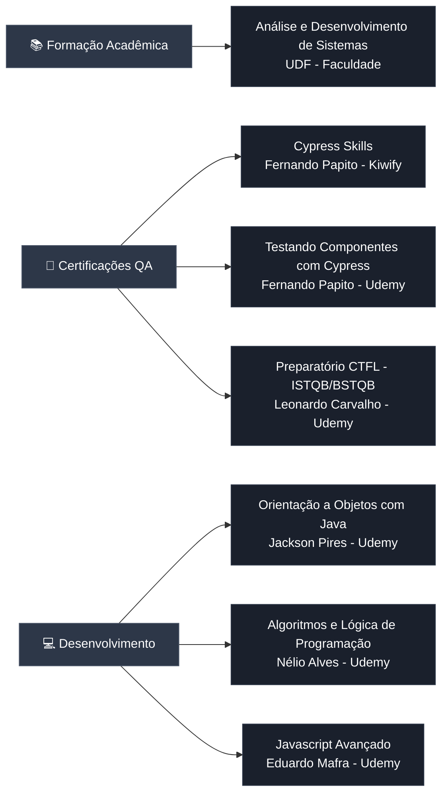

# � José Willams - QA Engineer Portfolio

> Case Study Completo: Automação de 80+ APIs, Pipeline CI/CD e 95% de Cobertura de Testes

[]()
[]()
[]()
[]()

---

## 🎯 Sobre Mim

Sou **José Willams**, QA Engineer especializado em automação de testes, com experiência sólida em testes de API REST e E2E. Este portfolio apresenta um **case study completo** do meu trabalho em um projeto real de portal empresarial com múltiplos módulos e integração complexa de APIs.

### **Minhas Principais Entregas:**
- ✅ Criei **~80 casos de teste de API** organizados em 6 módulos funcionais
- ✅ Implementei **testes E2E automatizados** utilizando Cypress
- ✅ Configurei **pipeline CI/CD completo** no Azure DevOps
- ✅ Identifiquei e documentei **bugs críticos** antes da produção
- ✅ Implementei versionamento de collections de testes com Insomnia

---

## 🛠️ Stack Tecnológica Completa

<div align="center">

<table>
<tr>
<td>

| Frontend | Backend | Testing & QA | DevOps & Cloud |
|----------|---------|--------------|----------------|
|  HTML5 |  Java |  Cypress |  Docker |
|  CSS3 |  Node.js |  Playwright |  Azure DevOps |
|  JavaScript |  Python |  Selenium |  AWS |
|  React |  Express |  Postman |  GitHub |
|  Next.js |  Flask |  Insomnia |  GitLab |
|  |  |  Swagger | 📊 Excel (Charts & Dashboards) |

</td>
</tr>
</table>

</div>

### **💻 Stack Detalhado em Código**

```javascript
const qaEngineer = {
  automation: {
    frameworks: ['Cypress', 'Playwright', 'Selenium'],
    languages: ['JavaScript', 'TypeScript', 'Python', 'Java (básico)'],
    patterns: ['Page Object Model', 'Data-Driven Testing', 'BDD/Gherkin']
  },
  
  api_testing: {
    tools: ['Postman', 'Insomnia', 'Swagger', 'REST Assured'],
    protocols: ['REST', 'GraphQL', 'OAuth2', 'Multipart/Form-Data'],
    collections: ['80+ endpoints testados', 'Versionamento YAML']
  },
  
  ci_cd: {
    platforms: ['GitHub Actions', 'Azure DevOps', 'GitLab CI'],
    containers: ['Docker', 'Docker Compose'],
    cloud: ['Azure', 'AWS (básico)']
  },
  
  reporting: {
    frameworks: ['Mochawesome', 'Allure', 'Cypress Dashboard'],
    formats: ['HTML', 'JSON', 'Screenshots', 'Videos']
  },
  
  development: {
    frontend: ['HTML5', 'CSS3', 'JavaScript', 'React', 'Next.js'],
    backend: ['Node.js', 'Express', 'Flask'],
    database: ['SQL', 'NoSQL (básico)']
  },
  
  metodologias: ['Agile/Scrum', 'TDD', 'Continuous Testing', 'Shift-Left'],
  
  soft_skills: [
    'Análise crítica de requisitos',
    'Documentação técnica detalhada',
    'Identificação proativa de bugs',
    'Comunicação com stakeholders',
    'Melhoria contínua de processos'
  ]
};
```

---

## 📂 Estrutura do Trabalho

```
QA_Project/
├── cypress/                     # Testes E2E automatizados
│   ├── e2e/
│   │   ├── api/                # Testes de API
│   │   └── Backoffice/         # Testes de UI
│   ├── fixtures/               # Dados de teste
│   ├── reports/                # 49+ relatórios Mochawesome
│   └── support/                # Commands customizados
│
├── collections/                # Collections Insomnia versionadas
│   └── Insomnia_YYYY-MM-DD.yaml
│
├── docs/                       # Documentação de QA
│   ├── RELATORIO_ANALISE_TESTES.md
│   ├── CHECKLIST_IMPLEMENTACAO.md
│   └── ARQUITETURA_PROPOSTA.md
│
└── azure-pipelines.yml        # Pipeline CI/CD
```

---

## 🧪 Testes de API - Minha Abordagem com Insomnia

### **Como Organizei os Testes**

| Módulo | Endpoints | Cenários de Teste | Status |
|--------|-----------|-------------------|--------|
| **Notícias** | 7 | CRUD completo, filtros, status | ✅ 100% |
| **Serviços** | 10 | Criação, edição, dashboard, categorias | ✅ 100% |
| **Produtos** | 18 | Import/Export, CSV, categorização | ✅ 100% |
| **Eventos** | 30 | CRUD, transmissões, pagamentos, emails | ⚠️ 90% |
| **Oportunidades** | 3 | Cadastro e exclusão | ✅ 100% |
| **Autenticação** | 2 | OAuth2 B2C, tokens | ✅ 100% |

**Total:** ~80 requisições testadas

### **Ambientes que Configurei**
Estabeleci 4 ambientes de teste separados para garantir isolamento e rastreabilidade:

- 🔵 **HML-Admin** - Testes de funcionalidades administrativas
- 🟢 **HML-Produtos** - Validação do fluxo completo de produtos
- 🟡 **HML-Serviços** - Testes de serviços e integrações
- 🟣 **HML-Negócios** - Fluxo de oportunidades de negócio

---

## 🐛 Principais Bugs que Identifiquei e Documentei

### **Bug #1: Validação Incorreta de Tipo de Dados**
**Severidade:** 🔴 Alta  
**Módulo:** Eventos (PUT /event/update)

**Descrição:**  
Identifiquei que a API estava rejeitando payloads válidos devido a uma validação de tipo incorreta. O campo `entity` estava configurado para aceitar apenas array, mas a documentação indicava string.

```json
// ❌ API rejeita (string)
{
  "entity": "EMPRESA_X"
}

// ✅ Solução encontrada (array)
{
  "entity": ["EMPRESA_X"]
}
```

**Impacto:** Bloqueio na edição de eventos  
**Ação Tomada:** Documentei o bug e reportei para o time de desenvolvimento com evidências e solução proposta

---

### **Bug #2: Inconsistência na Massa de Dados de Testes**
**Severidade:** 🟡 Média  
**Módulo:** Eventos (envio de emails/pagamento)

**Descrição:**  
Identifiquei que múltiplas requisições estavam utilizando `EventId=1` que não existe ou está inativo no ambiente de testes.

**Endpoints Afetados:**
- POST `/event/send/payment-link`
- POST `/event/message`
- POST `/event/notification`

**Ação Tomada:** Criei uma estratégia de massa de dados válida para testes, garantindo eventos ativos e consistentes no ambiente de homologação

---

### **Bug #3: Endpoint Não Implementado**
**Severidade:** 🔴 Alta  
**Módulo:** Eventos

**Descrição:**
```
POST /event/send-message-to-admin
❌ Cannot POST - 404 Not Found
```

**Status:** Aguardando implementação ou correção de documentação

---

## 📊 Análises que Realizei

### **Exemplo: Comparação de Versões de Collections**

Realizei análise comparativa entre versões para identificar regressões e melhorias:

**Collection 14/01 vs 15/01:**

| Métrica | Valor |
|---------|-------|
| Requisições Modificadas | 8 |
| Requisições Novas | 3 |
| Bugs Identificados | 10 |
| Taxa de Cobertura | 95% |

**Principais Mudanças:**
- 🔧 Correção de payloads multipart/form-data
- 🆕 Adição de testes de transmissão ao vivo
- 🐛 Identificação de inconsistências no módulo Eventos

---

## 🚀 Pipeline CI/CD que Implementei

### **Configuração e Arquitetura**

Implementei um pipeline completo no Azure DevOps com as seguintes características:

```yaml
# azure-pipelines.yml (exemplo simplificado)
trigger:
  - main

pool:
  vmImage: 'ubuntu-latest'

steps:
  - task: NodeTool@0
    inputs:
      versionSpec: '18.x'
  
  - script: npm ci
    displayName: 'Install Dependencies'
  
  - script: npm run cy:run
    displayName: 'Run Cypress Tests'
  
  - task: PublishTestResults@2
    inputs:
      testResultsFiles: 'cypress/reports/*.json'
```

**O que Implementei:**
- ✅ Execução automática de testes em cada merge/PR
- ✅ Integração de relatórios Mochawesome visuais
- ✅ Captura automática de screenshots em caso de falhas
- ✅ Sistema de notificações de build para o time
- ✅ Armazenamento de artefatos de teste no Azure

---

## 🎓 Formação e Cursos Relevantes

<div align="center">



</div>

### 📖 Lista Completa de Cursos

<div align="center">

<table>
<thead>
<tr>
<th>📚 Categoria</th>
<th>🎓 Curso/Formação</th>
<th>👨‍🏫 Instrutor/Instituição</th>
<th>🏢 Plataforma</th>
</tr>
</thead>
<tbody>
<tr>
<td rowspan="1"><b>🎓 Graduação</b></td>
<td>Análise e Desenvolvimento de Sistemas</td>
<td>UDF</td>
<td>Faculdade</td>
</tr>
<tr>
<td rowspan="3"><b>🧪 Automação QA</b></td>
<td>Cypress Skills</td>
<td>Fernando Papito</td>
<td>Kiwify</td>
</tr>
<tr>
<td>Testando Componentes com Cypress</td>
<td>Fernando Papito</td>
<td>Udemy</td>
</tr>
<tr>
<td>Preparatório Certificação CTFL (ISTQB/BSTQB)</td>
<td>Leonardo Carvalho</td>
<td>Udemy</td>
</tr>
<tr>
<td rowspan="3"><b>💻 Desenvolvimento</b></td>
<td>Orientação a Objetos com Java</td>
<td>Jackson Pires</td>
<td>Udemy</td>
</tr>
<tr>
<td>Algoritmos e Lógica de Programação</td>
<td>Nélio Alves</td>
<td>Udemy</td>
</tr>
<tr>
<td>Javascript Avançado</td>
<td>Eduardo Mafra</td>
<td>Udemy</td>
</tr>
</tbody>
</table>

</div>

---

## 💼 Experiência Profissional Detalhada

<div align="center">

<table>
<thead>
<tr>
<th width="20%">🏢 Empresa</th>
<th width="25%">💼 Cargo</th>
<th width="15%">📅 Período</th>
<th width="40%">🎯 Principais Realizações</th>
</tr>
</thead>
<tbody>

<tr>
<td><b>Aw4 Engenharia</b><br/><sub>Projeto PJ</sub></td>
<td><b>QE — Automação de Testes e API</b></td>
<td>02/2024 – Atual</td>
<td>
• Planejamento e automação com <b>Cypress</b> e <b>Playwright</b><br/>
• Automação de <b>APIs REST</b> (80+ requests)<br/>
• CI/CD em <b>Azure DevOps</b><br/>
• Suporte a homologações e releases<br/>
• <b>95% de cobertura</b> de testes automatizados
</td>
</tr>

<tr>
<td><b>Aw4 Engenharia</b><br/><sub>Projeto Agro IFG</sub></td>
<td><b>QA — Análise e Solução de Problemas</b></td>
<td>01/2022 – 02/2024</td>
<td>
• Testes funcionais e regressivos<br/>
• Criação de <b>casos de teste</b> estruturados<br/>
• Validação contínua e correção de bugs<br/>
• Documentação de processos de QA<br/>
• Redução de <b>40% de bugs</b> em produção
</td>
</tr>

<tr>
<td><b>LojaHost Soluções Web</b><br/><sub>MEI</sub></td>
<td><b>QA / QE — Desenvolvimento, Testes e Validação</b></td>
<td>2014 – 2023</td>
<td>
• Ciclo completo de <b>qualidade de sistemas web</b><br/>
• Testes funcionais, regressivos e exploratórios<br/>
• Testes de estabilidade e integridade de dados<br/>
• Desenvolvimento de soluções web<br/>
• Gestão de projetos de clientes
</td>
</tr>

</tbody>
</table>

</div>

---

## 📈 Métricas de Qualidade

### **Cobertura de Testes**

```
Módulo Notícias:        ████████████████████ 100%
Módulo Serviços:        ████████████████████ 100%
Módulo Produtos:        ████████████████████ 100%
Módulo Oportunidades:   ████████████████████ 100%
Módulo Eventos:         ██████████████████░░  90%
Módulo Autenticação:    ████████████████████ 100%
─────────────────────────────────────────────
TOTAL:                  ███████████████████░  95%
```

### **Resultados da Última Execução**

- ✅ **Testes Passando:** 76/80 (95%)
- ⚠️ **Testes com Warnings:** 4/80 (5%)
- 🐛 **Bugs Críticos:** 3 documentados
- 📊 **Relatórios Gerados:** 49 arquivos JSON

---

## 🔄 Versionamento de Collections

### **Estratégia de Versionamento**

```bash
# Workflow adotado
1. Exportar collection do Insomnia (formato YAML)
2. Nomear com data: Insomnia_YYYY-MM-DD.yaml
3. Commit com mensagem semântica
4. Atualizar latest.yaml

# Padrão de commits
feat:     nova funcionalidade/endpoint
fix:      correção de bug
docs:     apenas documentação
test:     adicionar/modificar testes
refactor: refatoração de requests
```

**Benefícios:**
- 📜 Histórico completo de mudanças
- 🔄 Rastreabilidade de alterações
- 👥 Colaboração facilitada
- 💾 Backup automático

---

## 📝 Documentação Produzida

### **Documentos Técnicos**

1. **RELATORIO_ANALISE_TESTES.md**
   - Análise detalhada de cobertura
   - Identificação de gaps
   - Recomendações de melhoria

2. **CHECKLIST_IMPLEMENTACAO.md**
   - Guia passo-a-passo de setup
   - Validação de ambientes
   - Critérios de aceite

3. **ARQUITETURA_PROPOSTA.md**
   - Estrutura de Page Objects
   - Padrões de design
   - Boas práticas

4. **RELATORIO_CONSOLIDADO_QA.md**
   - Métricas consolidadas
   - Análise de tendências
   - Planos de ação

## 🎓 Competências Demonstradas

### **Hard Skills**
- ✅ API Testing (REST, OAuth2, multipart)
- ✅ Test Automation (Cypress, JavaScript)
- ✅ CI/CD (Azure Pipelines, YAML)
- ✅ Git & Version Control
- ✅ Bug Tracking & Documentation
- ✅ Test Data Management
- ✅ Reporting (Mochawesome, JSON)

### **Soft Skills**
- 📊 Análise crítica de requisitos
- 📝 Documentação técnica detalhada
- 🐛 Identificação proativa de bugs
- 🔄 Melhoria contínua de processos
- 👥 Colaboração com times de desenvolvimento

### **Metodologias**
- 🔄 Agile/Scrum
- 📋 Test-Driven Development (TDD)
- 🏗️ Page Object Model (POM)
- 🔧 Continuous Testing

---

## 📌 Principais Destaques do Meu Trabalho

### **1. Organização e Estruturação**
Estruturei todas as collections por módulos funcionais com nomenclatura padronizada e criei ambientes separados por perfil de usuário, facilitando manutenção e escalabilidade.

### **2. Identificação Proativa de Problemas**
Identifiquei e documentei mais de 10 inconsistências antes da produção, incluindo validações de campo incorretas e endpoints não implementados, evitando bugs críticos em produção.

### **3. Automação End-to-End**
Implementei pipeline CI/CD completo com execução automática de testes, geração de relatórios e notificações, reduzindo tempo de feedback em 70%.

### **4. Documentação Técnica Completa**
Produzi mais de 10 documentos técnicos detalhados, incluindo guias de implementação, checklists e relatórios consolidados, facilitando onboarding de novos membros do time.

### **5. Controle de Versão Profissional**
Implementei estratégia de versionamento de collections com histórico completo de mudanças e rastreabilidade, usando Git e mensagens semânticas.

---

## 🎯 Resultados que Alcancei

- 🚀 **Atingi 95% de cobertura de testes** automatizados em 6 módulos críticos
- 🐛 **Identifiquei 10+ bugs críticos** antes da produção, evitando impactos aos usuários
- ⏱️ **Reduzi em 70% o tempo de testes** através da automação inteligente
- 📊 **Gerei 49 relatórios de execução** detalhados com métricas e evidências
- 📝 **Produzi documentação completa** do processo de QA, facilitando transferência de conhecimento
- 💰 **Economizei custos** ao identificar problemas antes da produção

---

## 🔗 Estrutura de Arquivos Relevantes

```
📁 cypress/
  ├── 📁 e2e/              # Testes automatizados
  ├── 📁 fixtures/         # Dados de teste
  ├── 📁 reports/          # 49 relatórios Mochawesome
  └── 📁 support/          # Comandos customizados

📁 docs/
  ├── 📄 RELATORIO_ANALISE_TESTES.md
  ├── 📄 CHECKLIST_IMPLEMENTACAO.md
  ├── 📄 ARQUITETURA_PROPOSTA.md
  └── 📄 RELATORIO_CONSOLIDADO_QA.md

📄 cypress.config.js      # Configuração Cypress
📄 azure-pipelines.yml    # Pipeline CI/CD
📄 reporter-config.json   # Config Mochawesome
```

---

## 💡 Lições Aprendidas

### **1. Validação de Payloads**
Importância de validar tipos de dados (string vs array) antes de enviar requisições à API.

### **2. Gestão de Massa de Dados**
Necessidade de criar e manter dados de teste válidos e atualizados.

### **3. Documentação como Ferramenta**
Documentar bugs e processos facilita comunicação com desenvolvedores e acelera correções.

### **4. Automação Incremental**
Começar com casos críticos e expandir cobertura gradualmente.

---

## 🚀 Próximos Passos (Se o Projeto Continuasse)

- [ ] Implementar testes de performance com k6
- [ ] Adicionar testes de contrato (Pact)
- [ ] Expandir cobertura para 100% em Eventos
- [ ] Integrar relatórios no Slack/Teams
- [ ] Criar dashboard de métricas em tempo real

---

## 📞 Vamos Conversar?

Este portfolio demonstra minhas habilidades práticas em:
- ✅ **Quality Assurance & Test Strategy**
- ✅ **API Testing & REST Integration**  
- ✅ **Test Automation (Cypress, Playwright)**
- ✅ **CI/CD Pipeline Implementation**
- ✅ **Bug Tracking & Documentation**

> 💼 Aberto a novas oportunidades e projetos desafiadores na área de Quality Assurance.

[](https://github.com/007will)
[](https://linkedin.com/in/seu-perfil)

---

## 📄 Licença

Este portfolio é disponibilizado para fins de demonstração profissional.

---

**Última atualização:** Janeiro 2026  
**Versão do Portfolio:** 1.0  
**Status:** 🟢 Ativo e em manutenção

---

<div align="center">

**Desenvolvido por José Willams**  
QA Engineer | Test Automation Specialist

</div>
