# 🚀 José Willams - Quality Engineer (QE)

> **Test Automation Specialist** | 80+ APIs Automatizadas | CI/CD DevOps | Arquitetura de Testes

[]()
[]()
[]()
[]()
[]()

---

## 👨‍💻 Sobre Mim

Sou **José Willams**, Quality Engineer (QE) especializado em **desenvolvimento de soluções de teste automatizadas**, com forte background em programação e DevOps. Este portfolio demonstra minha expertise técnica através de um **projeto completo** de automação de testes para um portal empresarial de larga escala.

**Foco Principal:**
- 🤖 Desenvolvimento de frameworks de automação
- 💻 Codificação de testes robustos e escaláveis  
- 🔧 Implementação de pipelines CI/CD
- 🏗️ Arquitetura de testes (Page Object Model, Factory Pattern)
- ⚙️ Integração contínua e entrega contínua

### **Stack Técnico - Minhas Principais Entregas:**

```javascript
const achievements = {
  automation: {
    frameworks_developed: ['Cypress E2E Suite', 'API Testing Framework'],
    tests_created: 80,
    coverage: '95%',
    execution_time_reduced: '70%'
  },
  
  code: {
    patterns: ['Page Object Model', 'Factory Pattern', 'Builder Pattern'],
    languages: ['JavaScript', 'TypeScript', 'Python'],
    lines_of_code: '5000+',
    reusable_components: 50
  },
  
  ci_cd: {
    pipelines_implemented: ['Azure DevOps', 'GitHub Actions'],
    automated_deployments: true,
    parallel_execution: true,
    reporting_integration: 'Mochawesome + Allure'
  },
  
  impact: {
    bugs_prevented: 10,
    cost_saved: 'Significativo',
    team_productivity: '+70%',
    release_confidence: 'High'
  }
};
```

**Principais Entregas Técnicas:**
- ✅ **Desenvolvei framework de automação** com 80+ testes de API usando Cypress + JavaScript
- ✅ **Implementei arquitetura Page Object Model** com componentes reutilizáveis
- ✅ **Configurei pipeline CI/CD completo** com execução paralela e relatórios automatizados
- ✅ **Criei utilitários e helpers customizados** para otimização de testes
- ✅ **Estabeleci estratégia de versionamento** usando Git Flow e semantic commits

---

## 🛠️ Stack Técnica e Ferramentas de Desenvolvimento

<div align="center">

<table>
<tr>
<td>

| Frontend | Backend | Testing & QA | DevOps & Cloud |
|----------|---------|--------------|----------------|
|  HTML5 |  Java |  Cypress |  Docker |
|  CSS3 |  Node.js |  Playwright |  Azure DevOps |
|  JavaScript |  Python |  Selenium |  AWS |
|  React |  Express |  Postman |  GitHub |
|  Next.js |  Flask |  Insomnia |  GitLab |
|  |  |  Swagger | 📊 Excel (Charts & Dashboards) |

</td>
</tr>
</table>

</div>

### **💻 Habilidades de Desenvolvimento (Code-First)**

```javascript
const qualityEngineer = {
  core_skills: {
    programming: ['JavaScript/ES6+', 'TypeScript', 'Python', 'Java'],
    test_frameworks: ['Cypress', 'Playwright', 'Selenium WebDriver', 'Jest'],
    architecture: ['Page Object Model', 'Screenplay Pattern', 'Factory Pattern']
  },
  
  automation_expertise: {
    web_automation: ['Cypress', 'Playwright', 'Selenium'],
    api_automation: ['Cypress API', 'SuperTest', 'REST Assured'],
    mobile: ['Appium (básico)', 'Detox (básico)'],
    performance: ['k6', 'Artillery']
  },
  
  api_development: {
    protocols: ['REST', 'GraphQL', 'WebSocket'],
    auth: ['OAuth2', 'JWT', 'Basic Auth', 'Bearer Token'],
    tools: ['Postman', 'Insomnia', 'Swagger/OpenAPI'],
    testing: ['Contract Testing', 'Integration Testing', 'E2E API Testing']
  },
  
  devops_cicd: {
    ci_platforms: ['Azure DevOps', 'GitHub Actions', 'GitLab CI', 'Jenkins'],
    containers: ['Docker', 'Docker Compose'],
    cloud: ['Azure', 'AWS (básico)'],
    version_control: ['Git', 'Git Flow', 'Conventional Commits']
  },
  
  quality_metrics: {
    reporting: ['Mochawesome', 'Allure Reports', 'Cypress Dashboard'],
    monitoring: ['Test Coverage', 'Execution Time', 'Flakiness Detection'],
    analysis: ['Failure Pattern Recognition', 'Root Cause Analysis']
  },
  
  software_engineering: {
    frontend_knowledge: ['HTML5', 'CSS3', 'JavaScript', 'React', 'Next.js'],
    backend_knowledge: ['Node.js', 'Express', 'Flask', 'RESTful APIs'],
    databases: ['SQL', 'NoSQL', 'Redis (cache)'],
    design_patterns: ['Singleton', 'Factory', 'Builder', 'Strategy']
  },
  
  methodologies: [
    'Agile/Scrum',
    'Test-Driven Development (TDD)',
    'Behavior-Driven Development (BDD)',
    'Continuous Testing',
    'Shift-Left Testing',
    'DevOps Culture'
  ],
  
  technical_skills: [
    'Code Review',
    'Pull Request Best Practices',
    'Debugging Complex Issues',
    'Performance Optimization',
    'Test Architecture Design',
    'Framework Development'
  ]
};
```

---

## 📂 Arquitetura do Framework de Automação

```
test-automation-framework/
├── cypress/
│   ├── e2e/
│   │   ├── api/                      # Testes de API (REST)
│   │   │   ├── api_auth.cy.js       # Autenticação OAuth2
│   │   │   ├── api_crud.cy.js       # CRUD operations
│   │   │   └── api_integration.cy.js # Testes de integração
│   │   └── ui/                       # Testes E2E de interface
│   │       ├── user_flows.cy.js
│   │       └── admin_flows.cy.js
│   │
│   ├── fixtures/                     # Test data (JSON, YAML)
│   │   ├── users.json
│   │   └── api_responses.json
│   │
│   ├── support/
│   │   ├── commands/                 # Custom commands reutilizáveis
│   │   │   ├── api_commands.js      # cy.apiLogin(), cy.apiRequest()
│   │   │   ├── ui_commands.js       # cy.login(), cy.fillForm()
│   │   │   └── assertions.js        # cy.shouldHaveValidSchema()
│   │   │
│   │   ├── pages/                    # Page Object Model
│   │   │   ├── BasePage.js          # Classe base com métodos comuns
│   │   │   ├── LoginPage.js
│   │   │   └── DashboardPage.js
│   │   │
│   │   ├── factories/                # Test Data Factories
│   │   │   └── UserFactory.js       # Gera dados de teste dinâmicos
│   │   │
│   │   ├── utils/                    # Utilitários
│   │   │   ├── dateHelper.js
│   │   │   ├── stringHelper.js
│   │   │   └── apiHelper.js
│   │   │
│   │   └── e2e.js                    # Setup global
│   │
│   └── reports/                      # Relatórios de execução
│       └── mochawesome/
│
├── .github/workflows/                # CI/CD GitHub Actions
│   └── test-automation.yml
│
├── azure-pipelines.yml              # CI/CD Azure DevOps
├── cypress.config.js                # Configuração do Cypress
├── package.json                     # Dependências do projeto
└── README.md                        # Documentação técnica
```

### **Padrões de Arquitetura Implementados:**

- ✅ **Page Object Model (POM)** - Separação clara entre lógica de teste e interação com UI
- ✅ **Factory Pattern** - Geração dinâmica de dados de teste
- ✅ **Command Pattern** - Comandos customizados reutilizáveis
- ✅ **Builder Pattern** - Construção fluente de objetos complexos
- ✅ **DRY Principle** - Código reutilizável e sem duplicação

---

## 🧪 Testes de API - Minha Abordagem com Insomnia

### **Como Organizei os Testes**

| Módulo | Endpoints | Cenários de Teste | Status |
|--------|-----------|-------------------|--------|
| **Notícias** | 7 | CRUD completo, filtros, status | ✅ 100% |
| **Serviços** | 10 | Criação, edição, dashboard, categorias | ✅ 100% |
| **Produtos** | 18 | Import/Export, CSV, categorização | ✅ 100% |
| **Eventos** | 30 | CRUD, transmissões, pagamentos, emails | ⚠️ 90% |
| **Oportunidades** | 3 | Cadastro e exclusão | ✅ 100% |
| **Autenticação** | 2 | OAuth2 B2C, tokens | ✅ 100% |

**Total:** ~80 requisições testadas

### **Ambientes que Configurei**
Estabeleci 4 ambientes de teste separados para garantir isolamento e rastreabilidade:

- 🔵 **HML-Admin** - Testes de funcionalidades administrativas
- 🟢 **HML-Produtos** - Validação do fluxo completo de produtos
- 🟡 **HML-Serviços** - Testes de serviços e integrações
- 🟣 **HML-Negócios** - Fluxo de oportunidades de negócio

---

## 🐛 Principais Bugs que Identifiquei e Documentei

### **Bug #1: Validação Incorreta de Tipo de Dados**
**Severidade:** 🔴 Alta  
**Módulo:** Eventos (PUT /event/update)

**Descrição:**  
Identifiquei que a API estava rejeitando payloads válidos devido a uma validação de tipo incorreta. O campo `entity` estava configurado para aceitar apenas array, mas a documentação indicava string.

```json
// ❌ API rejeita (string)
{
  "entity": "EMPRESA_X"
}

// ✅ Solução encontrada (array)
{
  "entity": ["EMPRESA_X"]
}
```

**Impacto:** Bloqueio na edição de eventos  
**Ação Tomada:** Documentei o bug e reportei para o time de desenvolvimento com evidências e solução proposta

---

### **Bug #2: Inconsistência na Massa de Dados de Testes**
**Severidade:** 🟡 Média  
**Módulo:** Eventos (envio de emails/pagamento)

**Descrição:**  
Identifiquei que múltiplas requisições estavam utilizando `EventId=1` que não existe ou está inativo no ambiente de testes.

**Endpoints Afetados:**
- POST `/event/send/payment-link`
- POST `/event/message`
- POST `/event/notification`

**Ação Tomada:** Criei uma estratégia de massa de dados válida para testes, garantindo eventos ativos e consistentes no ambiente de homologação

---

### **Bug #3: Endpoint Não Implementado**
**Severidade:** 🔴 Alta  
**Módulo:** Eventos

**Descrição:**
```
POST /event/send-message-to-admin
❌ Cannot POST - 404 Not Found
```

**Status:** Aguardando implementação ou correção de documentação

---

## 📊 Análises que Realizei

### **Exemplo: Comparação de Versões de Collections**

Realizei análise comparativa entre versões para identificar regressões e melhorias:

**Collection 14/01 vs 15/01:**

| Métrica | Valor |
|---------|-------|
| Requisições Modificadas | 8 |
| Requisições Novas | 3 |
| Bugs Identificados | 10 |
| Taxa de Cobertura | 95% |

**Principais Mudanças:**
- 🔧 Correção de payloads multipart/form-data
- 🆕 Adição de testes de transmissão ao vivo
- 🐛 Identificação de inconsistências no módulo Eventos

---

## 🚀 Pipeline CI/CD que Implementei

### **Configuração e Arquitetura**

Implementei um pipeline completo no Azure DevOps com as seguintes características:

```yaml
# azure-pipelines.yml (exemplo simplificado)
trigger:
  - main

pool:
  vmImage: 'ubuntu-latest'

steps:
  - task: NodeTool@0
    inputs:
      versionSpec: '18.x'
  
  - script: npm ci
    displayName: 'Install Dependencies'
  
  - script: npm run cy:run
    displayName: 'Run Cypress Tests'
  
  - task: PublishTestResults@2
    inputs:
      testResultsFiles: 'cypress/reports/*.json'
```

**O que Implementei:**
- ✅ Execução automática de testes em cada merge/PR
- ✅ Integração de relatórios Mochawesome visuais
- ✅ Captura automática de screenshots em caso de falhas
- ✅ Sistema de notificações de build para o time
- ✅ Armazenamento de artefatos de teste no Azure

---

## 🎓 Formação e Cursos Relevantes

```mermaid
graph LR
    A[📚 Formação Acadêmica] --> B[Análise e Desenvolvimento de Sistemas<br/>UDF - Faculdade]
    
    C[🎯 Certificações QA] --> D1[Cypress Skills<br/>Fernando Papito - Kiwify]
    C --> D2[Testando Componentes com Cypress<br/>Fernando Papito - Udemy]
    C --> D3[Preparatório CTFL - ISTQB/BSTQB<br/>Leonardo Carvalho - Udemy]
    
    E[💻 Desenvolvimento] --> F1[Orientação a Objetos com Java<br/>Jackson Pires - Udemy]
    E --> F2[Algoritmos e Lógica de Programação<br/>Nélio Alves - Udemy]
    E --> F3[Javascript Avançado<br/>Eduardo Mafra - Udemy]
    
    style A fill:#2d3748,stroke:#4a5568,color:#fff
    style C fill:#2d3748,stroke:#4a5568,color:#fff
    style E fill:#2d3748,stroke:#4a5568,color:#fff
    style B fill:#1a202c,stroke:#2d3748,color:#fff
    style D1 fill:#1a202c,stroke:#2d3748,color:#fff
    style D2 fill:#1a202c,stroke:#2d3748,color:#fff
    style D3 fill:#1a202c,stroke:#2d3748,color:#fff
    style F1 fill:#1a202c,stroke:#2d3748,color:#fff
    style F2 fill:#1a202c,stroke:#2d3748,color:#fff
    style F3 fill:#1a202c,stroke:#2d3748,color:#fff
```

<div align="center">



</div>

### 📖 Lista Completa de Cursos

<div align="center">

<table>
<thead>
<tr>
<th>📚 Categoria</th>
<th>🎓 Curso/Formação</th>
<th>👨‍🏫 Instrutor/Instituição</th>
<th>🏢 Plataforma</th>
</tr>
</thead>
<tbody>
<tr>
<td rowspan="1"><b>🎓 Graduação</b></td>
<td>Análise e Desenvolvimento de Sistemas</td>
<td>UDF</td>
<td>Faculdade</td>
</tr>
<tr>
<td rowspan="3"><b>🧪 Automação QA</b></td>
<td>Cypress Skills</td>
<td>Fernando Papito</td>
<td>Kiwify</td>
</tr>
<tr>
<td>Testando Componentes com Cypress</td>
<td>Fernando Papito</td>
<td>Udemy</td>
</tr>
<tr>
<td>Preparatório Certificação CTFL (ISTQB/BSTQB)</td>
<td>Leonardo Carvalho</td>
<td>Udemy</td>
</tr>
<tr>
<td rowspan="3"><b>💻 Desenvolvimento</b></td>
<td>Orientação a Objetos com Java</td>
<td>Jackson Pires</td>
<td>Udemy</td>
</tr>
<tr>
<td>Algoritmos e Lógica de Programação</td>
<td>Nélio Alves</td>
<td>Udemy</td>
</tr>
<tr>
<td>Javascript Avançado</td>
<td>Eduardo Mafra</td>
<td>Udemy</td>
</tr>
</tbody>
</table>

</div>

---

## 💼 Experiência Profissional Detalhada

<div align="center">

<table>
<thead>
<tr>
<th width="20%">🏢 Empresa</th>
<th width="25%">💼 Cargo</th>
<th width="15%">📅 Período</th>
<th width="40%">🎯 Principais Realizações</th>
</tr>
</thead>
<tbody>

<tr>
<td><b>Aw4 Engenharia</b><br/><sub>Projeto PJ</sub></td>
<td><b>QE — Automação de Testes e API</b></td>
<td>02/2024 – Atual</td>
<td>
• Planejamento e automação com <b>Cypress</b> e <b>Playwright</b><br/>
• Automação de <b>APIs REST</b> (80+ requests)<br/>
• CI/CD em <b>Azure DevOps</b><br/>
• Suporte a homologações e releases<br/>
• <b>95% de cobertura</b> de testes automatizados
</td>
</tr>

<tr>
<td><b>Aw4 Engenharia</b><br/><sub>Projeto Agro IFG</sub></td>
<td><b>QA — Análise e Solução de Problemas</b></td>
<td>01/2022 – 02/2024</td>
<td>
• Testes funcionais e regressivos<br/>
• Criação de <b>casos de teste</b> estruturados<br/>
• Validação contínua e correção de bugs<br/>
• Documentação de processos de QA<br/>
• Redução de <b>40% de bugs</b> em produção
</td>
</tr>

<tr>
<td><b>LojaHost Soluções Web</b><br/><sub>MEI</sub></td>
<td><b>QA / QE — Desenvolvimento, Testes e Validação</b></td>
<td>2014 – 2023</td>
<td>
• Ciclo completo de <b>qualidade de sistemas web</b><br/>
• Testes funcionais, regressivos e exploratórios<br/>
• Testes de estabilidade e integridade de dados<br/>
• Desenvolvimento de soluções web<br/>
• Gestão de projetos de clientes
</td>
</tr>

</tbody>
</table>

</div>

---

## 📈 Métricas de Qualidade

### **Cobertura de Testes**

```
Módulo Notícias:        ████████████████████ 100%
Módulo Serviços:        ████████████████████ 100%
Módulo Produtos:        ████████████████████ 100%
Módulo Oportunidades:   ████████████████████ 100%
Módulo Eventos:         ██████████████████░░  90%
Módulo Autenticação:    ████████████████████ 100%
─────────────────────────────────────────────
TOTAL:                  ███████████████████░  95%
```

### **Resultados da Última Execução**

- ✅ **Testes Passando:** 76/80 (95%)
- ⚠️ **Testes com Warnings:** 4/80 (5%)
- 🐛 **Bugs Críticos:** 3 documentados
- 📊 **Relatórios Gerados:** 49 arquivos JSON

---

## 🔄 Versionamento de Collections

### **Estratégia de Versionamento**

```bash
# Workflow adotado
1. Exportar collection do Insomnia (formato YAML)
2. Nomear com data: Insomnia_YYYY-MM-DD.yaml
3. Commit com mensagem semântica
4. Atualizar latest.yaml

# Padrão de commits
feat:     nova funcionalidade/endpoint
fix:      correção de bug
docs:     apenas documentação
test:     adicionar/modificar testes
refactor: refatoração de requests
```

**Benefícios:**
- 📜 Histórico completo de mudanças
- 🔄 Rastreabilidade de alterações
- 👥 Colaboração facilitada
- 💾 Backup automático

---

## 📝 Documentação Produzida

### **Documentos Técnicos**

1. **RELATORIO_ANALISE_TESTES.md**
   - Análise detalhada de cobertura
   - Identificação de gaps
   - Recomendações de melhoria

2. **CHECKLIST_IMPLEMENTACAO.md**
   - Guia passo-a-passo de setup
   - Validação de ambientes
   - Critérios de aceite

3. **ARQUITETURA_PROPOSTA.md**
   - Estrutura de Page Objects
   - Padrões de design
   - Boas práticas

4. **RELATORIO_CONSOLIDADO_QA.md**
   - Métricas consolidadas
   - Análise de tendências
   - Planos de ação

## 🎓 Competências Demonstradas

### **Hard Skills**
- ✅ API Testing (REST, OAuth2, multipart)
- ✅ Test Automation (Cypress, JavaScript)
- ✅ CI/CD (Azure Pipelines, YAML)
- ✅ Git & Version Control
- ✅ Bug Tracking & Documentation
- ✅ Test Data Management
- ✅ Reporting (Mochawesome, JSON)

### **Soft Skills**
- 📊 Análise crítica de requisitos
- 📝 Documentação técnica detalhada
- 🐛 Identificação proativa de bugs
- 🔄 Melhoria contínua de processos
- 👥 Colaboração com times de desenvolvimento

### **Metodologias**
- 🔄 Agile/Scrum
- 📋 Test-Driven Development (TDD)
- 🏗️ Page Object Model (POM)
- 🔧 Continuous Testing

---

## 📌 Principais Destaques do Meu Trabalho

### **1. Organização e Estruturação**
Estruturei todas as collections por módulos funcionais com nomenclatura padronizada e criei ambientes separados por perfil de usuário, facilitando manutenção e escalabilidade.

### **2. Identificação Proativa de Problemas**
Identifiquei e documentei mais de 10 inconsistências antes da produção, incluindo validações de campo incorretas e endpoints não implementados, evitando bugs críticos em produção.

### **3. Automação End-to-End**
Implementei pipeline CI/CD completo com execução automática de testes, geração de relatórios e notificações, reduzindo tempo de feedback em 70%.

### **4. Documentação Técnica Completa**
Produzi mais de 10 documentos técnicos detalhados, incluindo guias de implementação, checklists e relatórios consolidados, facilitando onboarding de novos membros do time.

### **5. Controle de Versão Profissional**
Implementei estratégia de versionamento de collections com histórico completo de mudanças e rastreabilidade, usando Git e mensagens semânticas.

---

## 🎯 Resultados que Alcancei

- 🚀 **Atingi 95% de cobertura de testes** automatizados em 6 módulos críticos
- 🐛 **Identifiquei 10+ bugs críticos** antes da produção, evitando impactos aos usuários
- ⏱️ **Reduzi em 70% o tempo de testes** através da automação inteligente
- 📊 **Gerei 49 relatórios de execução** detalhados com métricas e evidências
- 📝 **Produzi documentação completa** do processo de QA, facilitando transferência de conhecimento
- 💰 **Economizei custos** ao identificar problemas antes da produção

---

## 🔗 Estrutura de Arquivos Relevantes

```
📁 cypress/
  ├── 📁 e2e/              # Testes automatizados
  ├── 📁 fixtures/         # Dados de teste
  ├── 📁 reports/          # 49 relatórios Mochawesome
  └── 📁 support/          # Comandos customizados

📁 docs/
  ├── 📄 RELATORIO_ANALISE_TESTES.md
  ├── 📄 CHECKLIST_IMPLEMENTACAO.md
  ├── 📄 ARQUITETURA_PROPOSTA.md
  └── 📄 RELATORIO_CONSOLIDADO_QA.md

📄 cypress.config.js      # Configuração Cypress
📄 azure-pipelines.yml    # Pipeline CI/CD
📄 reporter-config.json   # Config Mochawesome
```

---

## 💡 Lições Aprendidas

### **1. Validação de Payloads**
Importância de validar tipos de dados (string vs array) antes de enviar requisições à API.

### **2. Gestão de Massa de Dados**
Necessidade de criar e manter dados de teste válidos e atualizados.

### **3. Documentação como Ferramenta**
Documentar bugs e processos facilita comunicação com desenvolvedores e acelera correções.

### **4. Automação Incremental**
Começar com casos críticos e expandir cobertura gradualmente.

---

## 🚀 Próximos Passos (Se o Projeto Continuasse)

- [ ] Implementar testes de performance com k6
- [ ] Adicionar testes de contrato (Pact)
- [ ] Expandir cobertura para 100% em Eventos
- [ ] Integrar relatórios no Slack/Teams
- [ ] Criar dashboard de métricas em tempo real

---

## 📞 Vamos Conversar?

Este portfolio demonstra minhas habilidades práticas em:
- ✅ **Quality Assurance & Test Strategy**
- ✅ **API Testing & REST Integration**  
- ✅ **Test Automation (Cypress, Playwright)**
- ✅ **CI/CD Pipeline Implementation**
- ✅ **Bug Tracking & Documentation**

> 💼 Aberto a novas oportunidades e projetos desafiadores na área de Quality Assurance.

[](https://github.com/007will)
[](https://linkedin.com/in/seu-perfil)

---

## 📄 Licença

Este portfolio é disponibilizado para fins de demonstração profissional.

---

**Última atualização:** Janeiro 2026  
**Versão do Portfolio:** 1.0  
**Status:** 🟢 Ativo e em manutenção

---

<div align="center">

**Desenvolvido por José Willams**  
QA Engineer | Test Automation Specialist

</div>
