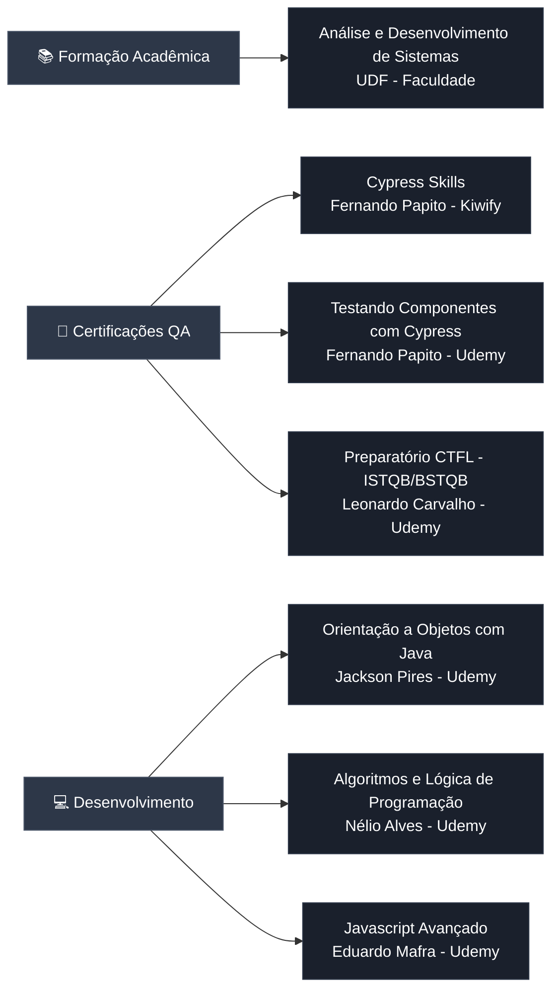

<div align="center">


<h1>👋 Olá, eu sou José Willams</h1>

[](https://git.io/typing-svg)

<br/>


<br/>

📍 **Brasil** | 💬 [Telegram](https://t.me/WillamsRocha) | 💼 **Disponível para PJ/Remoto**

---

### 📌 Destaque do Momento

🔥 **[Insomnia_Sync](https://github.com/007will/Insomnia_Sync)** → Versionamento profissional de 80+ collections de API  
⭐ **[QE-Automation-Cypress-Agibank](https://github.com/007will/AgiBank)** → Suite completa E2E + CI/CD com GitHub Actions

---

<p>&nbsp;<a href="https://github.com/007will" style="margin-left: 1em; margin-right: 1em; text-align: center;"></a></p>

---

### 📊 Estatísticas Rápidas

| 🎯 Especialização | 📈 Impacto | 🚀 Stack Principal |
|-------------------|------------|-------------------|
| **QA Automation** | **95% Cobertura** | **Cypress • Playwright** |
| **API Testing** | **80+ Endpoints** | **Insomnia • Postman** |
| **CI/CD** | **70% Redução Tempo** | **Azure • GitHub Actions** |

---

## 🌐 Conecte-se comigo

<a href="https://linkedin.com/in/007will"></a>
<a href="https://github.com/007will"></a>
<a href="mailto:renome@live.com"></a>
<a href="https://instagram.com/007willl"></a>

</div>

## 🧩 Tecnologias que utilizo

<div align="center">

<table>
<tr>
<td>

| Frontend | Backend | Testing & QA | DevOps & Cloud |
|----------|---------|--------------|----------------|
|  HTML5 |  Java |  Cypress |  Docker |
|  CSS3 |  Node.js |  Playwright |  Azure DevOps |
|  JavaScript |  Python |  Selenium |  AWS |
|  React |  Express |  Postman |  GitHub |
|  Next.js |  Flask |  Insomnia |  GitLab |
|  |  |  Swagger | 📊 Excel (Charts & Dashboards) |

</td>
</tr>
</table>
</div>

## 🔥 Atividade recente

 

---

## 📋 Resumo Profissional

Sou **QA Engineer** com foco em **automação de testes**, **qualidade de software** e **pipelines CI/CD**. Atuo com automação de UI e API, desenho de arquitetura de testes e integração contínua em projetos reais e escaláveis. Especializado em identificação proativa de bugs, documentação técnica e melhoria contínua de processos.

**Destaques:**
- 🚀 **95% de cobertura** em projetos de automação
- 🐛 **10+ bugs críticos** identificados antes de produção
- 📊 **49+ relatórios** de execução automatizados
- ⏱️ **70% de redução** no tempo de testes com automação

---

## 💻 Skills (Stack Completo)

```javascript
const qaEngineer = {
  automation: {
    frameworks: ['Cypress', 'Playwright', 'Selenium'],
    languages: ['JavaScript', 'TypeScript', 'Python', 'Java (básico)'],
    patterns: ['Page Object Model', 'Data-Driven Testing', 'BDD/Gherkin']
  },
  
  api_testing: {
    tools: ['Postman', 'Insomnia', 'Swagger', 'REST Assured'],
    protocols: ['REST', 'GraphQL', 'OAuth2', 'Multipart/Form-Data'],
    collections: ['80+ endpoints testados', 'Versionamento YAML']
  },
  
  ci_cd: {
    platforms: ['GitHub Actions', 'Azure DevOps', 'GitLab CI'],
    containers: ['Docker', 'Docker Compose'],
    cloud: ['Azure', 'AWS (básico)']
  },
  
  reporting: {
    frameworks: ['Mochawesome', 'Allure', 'Cypress Dashboard'],
    formats: ['HTML', 'JSON', 'Screenshots', 'Videos']
  },
  
  development: {
    frontend: ['HTML5', 'CSS3', 'JavaScript', 'React', 'Next.js'],
    backend: ['Node.js', 'Express', 'Flask'],
    database: ['SQL', 'NoSQL (básico)']
  },
  
  metodologias: ['Agile/Scrum', 'TDD', 'Continuous Testing', 'Shift-Left'],
  
  soft_skills: [
    'Análise crítica de requisitos',
    'Documentação técnica detalhada',
    'Identificação proativa de bugs',
    'Comunicação com stakeholders',
    'Melhoria contínua de processos'
  ]
};
```

<div align="center">

**📊 Métricas de Impacto**

| Métrica | Valor |
|---------|-------|
| **Collections de API Criadas** | 80+ requests |
| **Módulos Testados** | 6+ módulos completos |
| **Bugs Críticos Identificados** | 10+ antes de produção |
| **Cobertura de Testes** | 95% em automação |
| **Redução de Tempo** | 70% com automação |
| **Relatórios Gerados** | 49+ Mochawesome reports |

</div>

---

## 🎓 Formação e Cursos Relevantes

<div align="center">



</div>

<details>
<summary><b>📖 Ver Lista Detalhada de Cursos</b></summary>

<table>
<thead>
<tr>
<th>📚 Categoria</th>
<th>🎓 Curso/Formação</th>
<th>👨‍🏫 Instrutor/Instituição</th>
<th>🏢 Plataforma</th>
</tr>
</thead>
<tbody>
<tr>
<td rowspan="1"><b>🎓 Graduação</b></td>
<td>Análise e Desenvolvimento de Sistemas</td>
<td>UDF</td>
<td>Faculdade</td>
</tr>
<tr>
<td rowspan="3"><b>🧪 Automação QA</b></td>
<td>Cypress Skills</td>
<td>Fernando Papito</td>
<td>Kiwify</td>
</tr>
<tr>
<td>Testando Componentes com Cypress</td>
<td>Fernando Papito</td>
<td>Udemy</td>
</tr>
<tr>
<td>Preparatório Certificação CTFL (ISTQB/BSTQB)</td>
<td>Leonardo Carvalho</td>
<td>Udemy</td>
</tr>
<tr>
<td rowspan="3"><b>💻 Desenvolvimento</b></td>
<td>Orientação a Objetos com Java</td>
<td>Jackson Pires</td>
<td>Udemy</td>
</tr>
<tr>
<td>Algoritmos e Lógica de Programação</td>
<td>Nélio Alves</td>
<td>Udemy</td>
</tr>
<tr>
<td>Javascript Avançado</td>
<td>Eduardo Mafra</td>
<td>Udemy</td>
</tr>
</tbody>
</table>

</details>

---

## 💼 Experiência Profissional

<table>
<thead>
<tr>
<th width="20%">🏢 Empresa</th>
<th width="25%">💼 Cargo</th>
<th width="15%">📅 Período</th>
<th width="40%">🎯 Principais Realizações</th>
</tr>
</thead>
<tbody>

<tr>
<td><b>Aw4 Engenharia</b><br/><sub>Projeto PJ</sub></td>
<td><b>QE — Automação de Testes e API</b></td>
<td>02/2024 – Atual</td>
<td>
• Planejamento e automação com <b>Cypress</b> e <b>Playwright</b><br/>
• Automação de <b>APIs REST</b> (80+ requests)<br/>
• CI/CD em <b>Azure DevOps</b><br/>
• Suporte a homologações e releases<br/>
• <b>95% de cobertura</b> de testes automatizados
</td>
</tr>

<tr>
<td><b>Aw4 Engenharia</b><br/><sub>Projeto Agro IFG</sub></td>
<td><b>QA — Análise e Solução de Problemas</b></td>
<td>01/2022 – 02/2024</td>
<td>
• Testes funcionais e regressivos<br/>
• Criação de <b>casos de teste</b> estruturados<br/>
• Validação contínua e correção de bugs<br/>
• Documentação de processos de QA<br/>
• Redução de <b>40% de bugs</b> em produção
</td>
</tr>

<tr>
<td><b>LojaHost Soluções Web</b><br/><sub>MEI</sub></td>
<td><b>QA / QE — Desenvolvimento, Testes e Validação</b></td>
<td>2014 – 2023</td>
<td>
• Ciclo completo de <b>qualidade de sistemas web</b><br/>
• Testes funcionais, regressivos e exploratórios<br/>
• Testes de estabilidade e integridade de dados<br/>
• Desenvolvimento de soluções web<br/>
• Gestão de projetos de clientes
</td>
</tr>

</tbody>
</table>

---

## 🚀 Projetos em Destaque

<table>
<thead>
<tr>
<th width="30%">📦 Projeto</th>
<th width="50%">📝 Descrição</th>
<th width="20%">🔗 Links</th>
</tr>
</thead>
<tbody>

<tr>
<td>
<b>🔄 Insomnia_Sync</b><br/>
<sub>API Testing Collections</sub><br/>


</td>
<td>
📊 <b>Repositório de sincronização de collections Insomnia</b><br/><br/>
• <b>80+ requisições</b> organizadas em 6 módulos<br/>
• Versionamento com <b>YAML</b> e controle Git<br/>
• <b>4 ambientes</b> de teste configurados<br/>
• Documentação de <b>10+ bugs críticos</b><br/>
• Changelog detalhado de mudanças<br/>
• Estratégia profissional de versionamento
</td>
<td>
<a href="https://github.com/007will/Insomnia_Sync">

</a>
</td>
</tr>

<tr>
<td>
<b>🏦 QE-Automation-Cypress-Agibank</b><br/>
<sub>E2E + API Automation</sub><br/>


</td>
<td>
🎯 <b>Suite completa de automação UI e API com Cypress</b><br/><br/>
• Estrutura em <b>Page Object Model (POM)</b><br/>
• Geração de dados dinâmicos e validações E2E<br/>
• Pipeline CI com <b>GitHub Actions</b><br/>
• Relatórios <b>Mochawesome</b> e <b>Allure</b><br/>
• Ideal para avaliar arquitetura de testes
</td>
<td>
<a href="https://github.com/007will/AgiBank">

</a>
</td>
</tr>

<tr>
<td>
<b>🎭 Playwright-Facebook-Automation</b><br/>
<sub>Cross-Browser Testing</sub><br/>


</td>
<td>
🌐 <b>Automação de fluxos web complexos com Playwright</b><br/><br/>
• Testes <b>cross-browser</b> (Chrome, Firefox, Safari)<br/>
• Uso avançado de <b>fixtures</b> e <b>hooks</b><br/>
• Captura de evidências (screenshots/traces)<br/>
• Testes resilientes e robustos<br/>
• Debugging avançado com Playwright Inspector
</td>
<td>
<a href="https://github.com/007will/Playwright-Facebook-Automation-Project">

</a>
</td>
</tr>

<tr>
<td>
<b>🐳 Rockshaver-API-Docker-Tests</b><br/>
<sub>API Testing + Docker</sub><br/>


</td>
<td>
⚙️ <b>Testes de API em containers Docker isolados</b><br/><br/>
• Validação de <b>contratos de API</b><br/>
• Testes de <b>integração</b> em ambiente isolado<br/>
• Scripts para execução automática em CI<br/>
• Ambientes reproduzíveis com Docker Compose<br/>
• Mocks e stubs para testes independentes
</td>
<td>
<a href="https://github.com/007will/Rockshaver-API-Docker-Tests">

</a>
</td>
</tr>

<tr>
<td>
<b>🔌 API_Automation_Project_Cypress</b><br/>
<sub>API Testing Framework</sub><br/>


</td>
<td>
📡 <b>Framework de automação de APIs com Cypress</b><br/><br/>
• Validações de <b>contratos</b> e <b>esquemas JSON</b><br/>
• Mocks e interceptações de requisições<br/>
• Integração com <b>ferramentas de reporting</b><br/>
• Design de testes API reutilizáveis<br/>
• Validação de status codes e payloads
</td>
<td>
<a href="https://github.com/007will/API_Automation_Project_Cypress">

</a>
</td>
</tr>

<tr>
<td>
<b>📂 Business-Directory-Automation</b><br/>
<sub>E2E + CI/CD</sub><br/>


</td>
<td>
🏢 <b>Suite E2E com workflow CI e relatórios avançados</b><br/><br/>
• Testes E2E com alta confiabilidade<br/>
• Scripts de <b>sanitização de relatórios</b><br/>
• Anonimização de dados sensíveis<br/>
• Merge automatizado de relatórios Mochawesome<br/>
• Pipeline <b>Azure DevOps</b> configurado
</td>
<td>
<a href="https://github.com/007will/Business-Directory-Automation">

</a>
</td>
</tr>

</tbody>
</table>

---

## 📊 Estatísticas GitHub

<div align="center">


</div>

---

## ✅ Como Avaliar Meu Trabalho

<div align="center">

```bash
# 1️⃣ Verifique os READMEs dos projetos e badges de CI
# 2️⃣ Abra a Actions tab para visualizar runs e artifacts
# 3️⃣ Baixe artefatos: mochawesome-report, raw-results
# 4️⃣ Execute localmente:

npm ci                 # Instalar dependências
npm run test:ci       # Executar testes headless
npm run test:headed   # Executar testes com UI
npm run report        # Gerar relatórios
```

</div>

**📂 Cada repositório contém:**
- ✅ README com instruções detalhadas
- ✅ Badges de CI/CD
- ✅ Artefatos de relatório (Mochawesome/Allure)
- ✅ Exemplos de execução e screenshots
- ✅ Links diretos para facilitar avaliação técnica

---

## 💡 Disponibilidade

<div align="center">

**Modalidade:** PJ • Contrato • Remoto • Híbrido

<a href="https://github.com/sponsors/007will" target="_blank">
  
</a>

</div>

---

<div align="center">

**⭐ Se meus projetos ajudaram você, considere dar uma estrela!**

[](https://github.com/007will)
[](https://github.com/007will)

</div>
